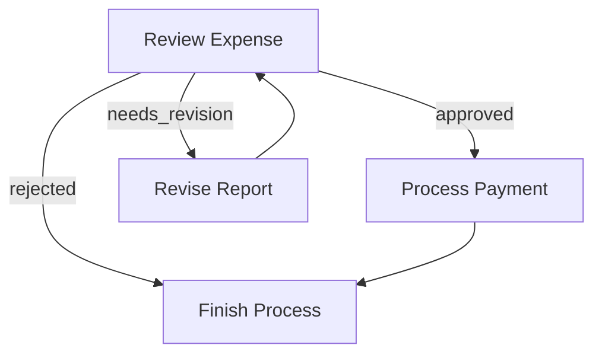
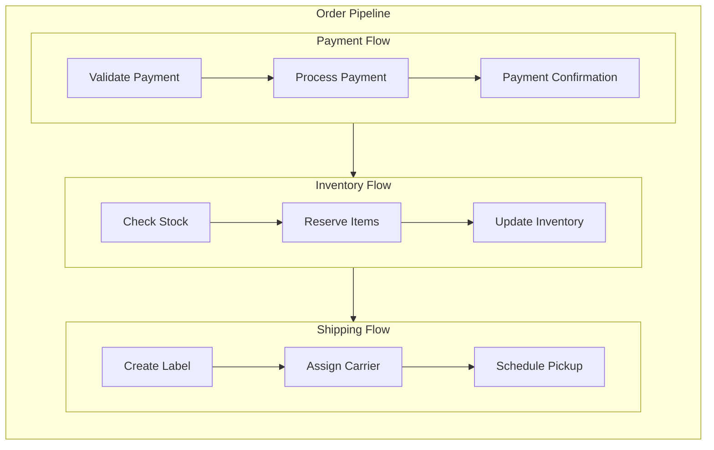

# 4- Flow

A **Flow** orchestrates how Nodes connect and run, based on **Actions** returned from each Node’s `post()` method. You can chain Nodes in a sequence or create branching logic depending on the **Action** string.

Note that whilst **Flow** also extends the BaseNode interface, the `exec()` method is not allowed. This was a feature of the [original implementation](https://github.com/The-Pocket/PocketFlow/blob/main/docs/flow.md), to allow the `run()` method to take in the SharedData and force execution that way. I might refactor this later, but yet to find a use case.

## 1. Action-based Transitions

Each Node's `post(shared, prepRes, execRes)` method returns an **Action** string. By default, if `post()` doesn't explicitly return anything, we treat that as `"default"`.

You define transitions with the syntax:

1. Basic default transition: `nodeA >> nodeB`
  This means if `nodeA.post()` returns `"default"` (or `void`), go to `nodeB`. 
  (Equivalent to `nodeA - "default" >> nodeB`)

2. Named action transition: `nodeA - "action_name" >> nodeB`
  This means if `nodeA.post()` returns `"action_name"`, go to `nodeB`.

It’s possible to create loops, branching, or multi-step flows.

## 2. Creating a Flow

A **Flow** begins with a **start** node (or flow). You call `Flow(someNode)` to specify the entry point. When you call `flow.run(shared)`, it executes the first node, looks at its `post()` return Action, follows the corresponding transition, and continues until there’s no next node or you explicitly stop.

### Example: Simple Sequence

Here’s a minimal flow of two nodes in a chain:

```javascript
nodeA >> nodeB
const flow = new Flow(nodeA)
await flow.run(shared)
```

- When you run the flow, it executes `nodeA`.  
- Suppose `nodeA.post()` returns `"default"`.  
- The flow then sees `"default"` Action is linked to `nodeB` and runs `nodeB`.  
- If `nodeB.post()` returns `"default"` but we didn’t define `nodeB >> somethingElse`, the flow ends there.

### Example: Branching & Looping

Here's a simple expense approval flow that demonstrates branching and looping. The `ReviewExpense` node can return three possible Actions. 

> Note, for convention, we use snake_case to define action names

- `"approved"`: expense is approved, move to payment processing
- `"needs_revision"`: expense needs changes, send back for revision 
- `"rejected"`: expense is denied, finish the process

We can wire them like this:

```javascript
// Define the flow connections
review - "approved" >> payment        // If approved, process payment
review - "needs_revision" >> revise   // If needs changes, go to revision
review - "rejected" >> finish           // If rejected, finish the process

revise >> review   // After revision, go back for another review
payment >> finish     // After payment, finish the process

const flow = new Flow(review) // review
```

Let's see how it flows:

1. If `review.post()` returns `"approved"`, the expense moves to `payment` node
2. If `review.post()` returns `"needsRevision"`, it goes to `revise` node, which then loops back to `review`
3. If `review.post()` returns `"rejected"`, it moves to `finish` node and stops



### Running Individual Nodes vs. Running a Flow

- `node.run(shared)`: Just runs that node alone (calls `prep()`, `exec()`, `post()`), returns an Action. 
- `flow.run(shared)`: Executes from the start node, follows Actions to the next node, and so on until the flow can’t continue (no next node or no next Action).


> node.run(shared) **does not** proceed automatically to the successor and may use incorrect parameters.
> This is mainly for debugging or testing a single node.
> Always use `flow.run(...)` in production to ensure the full pipeline runs correctly.


## 3. Nested Flows

A **Flow** can act like a Node, which enables powerful composition patterns. This means you can:

1. Use a Flow as a Node within another Flow's transitions.  
2. Combine multiple smaller Flows into a larger Flow for reuse.  
3. Node `params` will be a merging of **all** parents' `params`.

### Basic Flow Nesting

Here's how to connect a flow to another node:

```javascript
// Create a sub-flow
nodeA >> nodeB
let subflow = Flow(nodeA)

// Connect it to another node
subflow >> nodeC

// Create the parent flow
let parentFlow = new Flow(subflow)
```

When `parentFlow.run()` executes:
1. It starts `subflow`
2. `subflow` runs through its nodes (`nodeA` then `nodeB`)
3. After `subflow` completes, execution continues to `nodeC`

### Example: Order Processing Pipeline

Here's a practical example that breaks down order processing into nested flows:

```javascript
// Define the nodes
let validatePayment = ValidatePayment()
let processPayment = ProcessPayment()
let paymentConfirmation = PaymentConfirmation()
let checkStock = CheckStock()
let reserveItems = ReserveItems()
let updateInventory = UpdateInventory()
let createLabel = CreateLabel()
let assignCarrier = AssignCarrier()
let schedulePickup = SchedulePickup()

// Payment processing sub-flow
validatePayment >> processPayment >> paymentConfirmation
const paymentFlow = new Flow(validatePayment)

// Inventory sub-flow
checkStock >> reserveItems >> updateInventory
const inventoryFlow = new Flow(checkStock)

// Shipping sub-flow
createLabel >> assignCarrier >> schedulePickup
const shippingFlow = new Flow(createLabel)

// Connect the flows into a main order pipeline
paymentFlow >> inventoryFlow >> shippingFlow

// Create the master flow
const orderPipeline = new Flow(paymentFlow)

// Run the entire pipeline
await orderPipeline.run(shared_data)
```

This creates a clean separation of concerns while maintaining a clear execution path:

